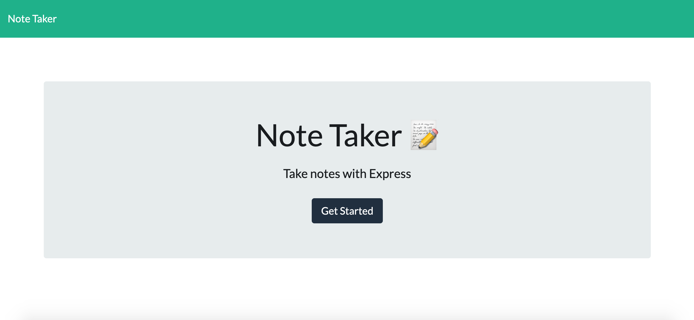
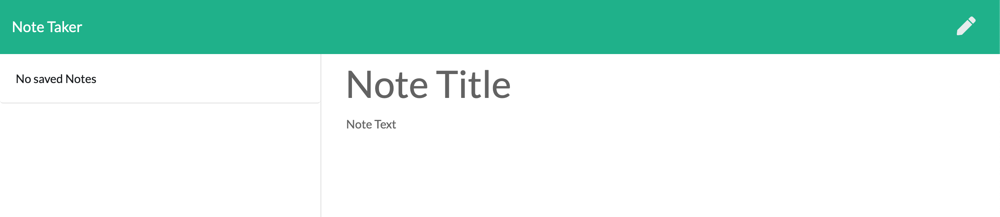
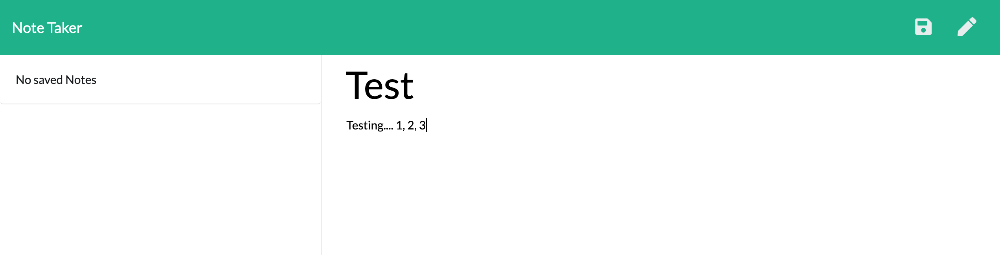
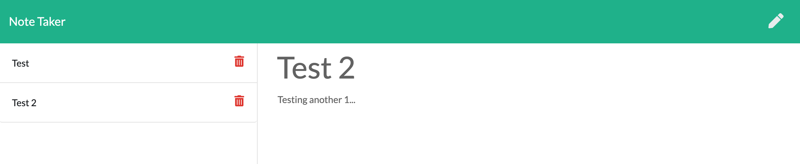
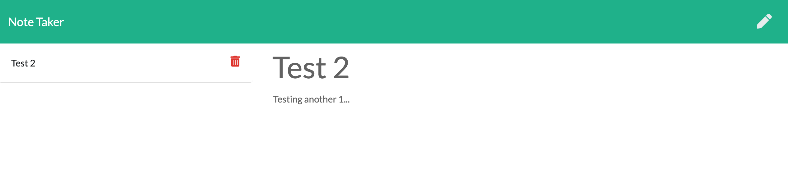

# Note Taker

## Description 
An application that can be used to write, save, and delete notes by using an express backend and save and retrieve note data from a JSON file

## Table of contents
* [Installation](#installation)
* [Usage](#usage)
* [Contributing](#contributing)
* [Questions](#questions)

## Installation
To install necessary dependencies, run the following command:
npm install

## Usage
When you first visit the site, you will be taken to the homepage that will provide you with a button to 'get started'

Once you have pressed on the button, you will be redirected to the notes page where you can write, save and delete notes

The save button will appear once you have started entering the contents for your new note

When you have saved your new note, you will be able to create as many more as you would like

You can also delete any notes that have been saved and the page will update with the new list of your notes

## Contributing 
If you would like to make changes please include a description and images of the feature with a pull request

## Questions

If you have any questions about the repo, open an issue or contact  directly at sylhuynh76@gmail.com

